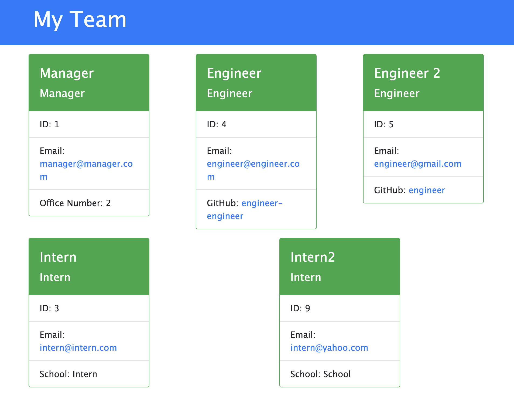

# Team Profile Generator

## Description

This is a Node.js command-line application that takes in information about employees on a software engineering team, then generates an HTML webpage that displays summaries for each person.

## Table of Contents

- [Installation](#installation)
- [Usage](#usage)
- [Credits](#credits)
- [License](#license)
## Installation
Please install the Node.JS package, and copy the app into your folder.
## Usage
The application will be invoked by using the following command:

```bash
node index.js
```
Here is a [link](https://drive.google.com/file/d/1DliJFp3OKPsjxrIblFZQjJywJtcdo3qu/view?usp=sharing) to the video demonstrating the functionality of the app. This is a screenshot of the functionality of the app: 
## Questions
Please email me at [my email address](ucsd.camp.21@ucsd.edu) if you have any questions!
## License
None.
## Credits
Thank you, John! :)